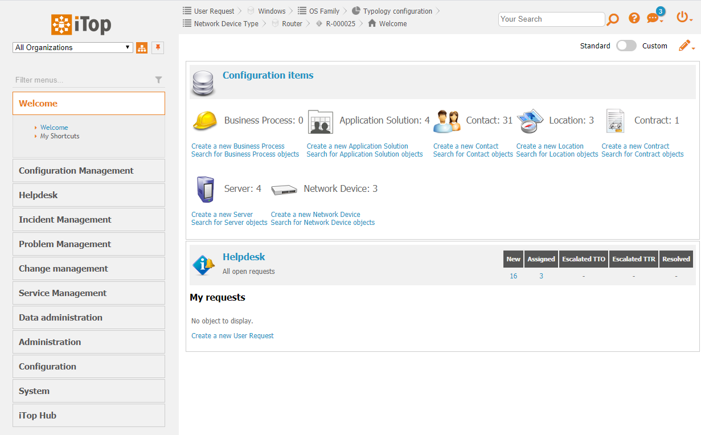

# Extension: combodo-menu-filter
- [Description](#description)
- [Compatibility](#compatibility)
- [Screenshots](#screenshots)
- [Keyboard shortcuts](#keyboard-shortcuts)
- [TODOs](#todos)

## Description
Administration console only.

Adds a filter above the main menu to help find entries quickly.

## Compatibility
Compatible with iTop 2.6+

## Screenshots
*Filter is above the main menu*

*Type something in it to show only mathcing entries*

## Keyboard shortcuts
- "Esc": Clear filter

## TODOs
Things to do before going public:
- [ ] French translations
- [ ] Refactor JS in a proper/nicer JS widget