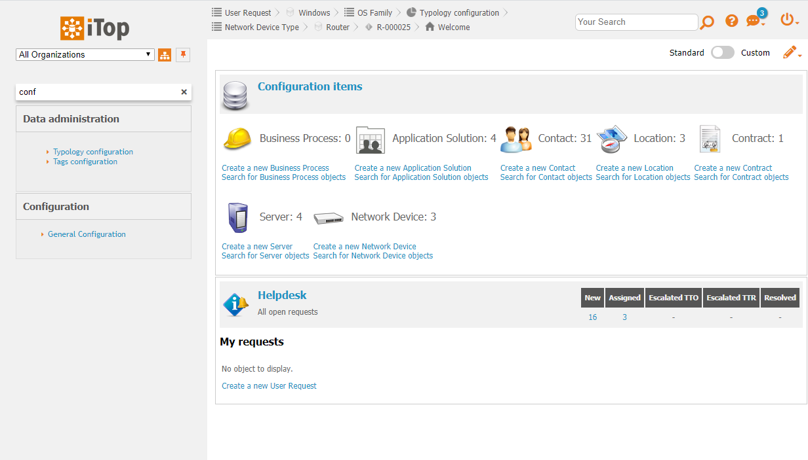

# iTop module : Admin. console: Quick menu filter

## About

This is the module used in the Quick Menu Search extension for [iTop](https://github.com/Combodo/iTop).

Adds a filter above the main menu to help find entries quickly.

### Compatibility
Compatible with iTop 2.7+

### Screenshots
*Filter is above the main menu*

*Type something in it to show only mathcing entries*

### Keyboard shortcuts
- "Esc": Clear filter

## Download

Release packages can be found on the [iTop Hub Store](https://store.itophub.io/en_US/taxons/all-extensions). This is the best way to get
 a running package as those contains all the needed modules and stable code.

When downloading directly from GitHub (by cloning or downloading as zip) you will get potentially unstable code, and you will miss
 additional modules.

## About Us

This iTop module development is sponsored, led and supported by [Combodo](https://www.combodo.com).

